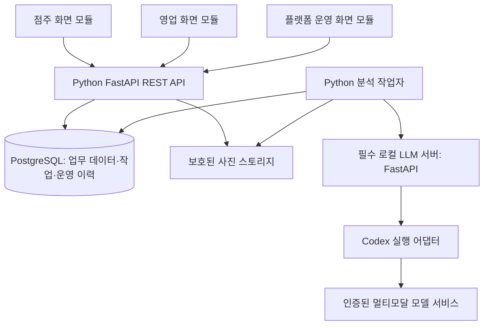

# Architecture & Tech Stack: StoreLoop

> 기준: [00-vision.md](./00-vision.md), 2026-09-21 현재 내용과 사용자 지정 기술 조건.
> **프론트엔드는 React, 백엔드는 Python + FastAPI, 로컬 LLM 분석 서버는 반드시 구현한다.** 이 문서는 구현 설계이며 실행·검증 완료를 뜻하지 않는다. 문서 준비 단계에서는 소스를 구현하지 않는다.

## 1. 아키텍처 목표와 범위

StoreLoop는 운영 데이터 관리, 본사·OFC 관제, 점주의 현장 개선, 플랫폼 운영을 하나의 데이터 흐름으로 연결한다. 사진 분석과 영업 대시보드, 서비스 운영 기능을 각각 독립적인 책임으로 설계한다.

| 비전의 요구 | 아키텍처 반영 |
|---|---|
| 점주 사진·질문 제출과 AI 피드백 | 점주 화면 모듈 → Python API → 비동기 작업자 → 로컬 LLM 서버 |
| 본사·지역·OFC 관제 | 영업 화면 모듈, 서버에서 역할별 집계·필터·상세 조회 |
| 운영 기준과 데이터 관리 | 관계형 DB, 기준 버전·적용 스냅샷·평가·후속 이력 연결 |
| 플랫폼 운영자 | 컨셉 패키지 내 독립 운영 화면 영역, 계정·권한·기준 정보·서비스 상태·재처리 관리 |
| AI는 보조 판단 | 판단 불가·OFC 확인 필요·에스컬레이션을 데이터로 보존 |
| 실패 대응과 운영 추적 | 영속 작업 대기열, 처리 시도 이력, 운영 변경 감사 이력 |

초기 구성은 **도메인별 모듈로 나눈 단일 FastAPI 백엔드 + 별도 Python 작업자 + 로컬 Python AI 서버**다. 도메인별 마이크로서비스, 메시지 브로커, 벡터 DB는 필수로 도입하지 않는다. 작업자와 API는 동일한 도메인 코드와 DB를 공유하되 프로세스는 분리한다.

비전의 Business Constraints는 4~6개 카테고리, MVP Objective는 1~2종을 언급한다. 구조는 4~6개 이상을 데이터로 등록할 수 있게 만들고 초기 시연은 1~2종부터 검증하는 것을 계획 기준으로 삼는다. 카테고리 수와 이름을 코드에 고정하지 않으며 비전 문서는 변경하지 않는다.

## 2. 기술 스택

| 계층 | 선택 | 선택 이유·책임 |
|---|---|---|
| 프론트엔드 | React + TypeScript | 점주·영업·플랫폼 운영 화면 구현, 컨셉별 패키지와 역할별 화면 모듈 분리 |
| 빌드 | Vite | 로그인 중심 SPA의 개발·빌드. 초기에는 SSR이 필요하지 않음 |
| 화면 라우팅 | React Router | 앱별 페이지와 진입 권한 처리 |
| 서버 상태 | TanStack Query | 조회 캐시, 처리 상태 polling, 변경 후 재조회 |
| 스타일 | CSS 변수 기반 공통 토큰 + 앱별 CSS Modules | 색·간격·상태 표현 공유, 역할별 레이아웃 분리 |
| 영업 차트 | Recharts | 시계열·산점도·요약 시각화, 상세 분석 단계에서 도입 |
| 업무 API | Python + FastAPI + Uvicorn | 인증·인가, 데이터 관리, 트랜잭션, 업무 API |
| 인증 | 서버 측 DB 세션 + HttpOnly 쿠키 + CSRF 보호 | 브라우저 중심 제품에서 계정 비활성화·권한 변경을 서버에서 즉시 확인 |
| ORM / DB 드라이버 | SQLAlchemy 2.x + psycopg | 관계 모델과 명시적인 트랜잭션, 동기 DB 접근 |
| 마이그레이션 | Alembic | 스키마 변경 이력·의존 순서 관리, 생성한 revision 검토 |
| 기본 DB | PostgreSQL | 관계·제약·집계, 작업 점유와 동시 재처리를 트랜잭션으로 관리 |
| 개발용 DB 대안 | SQLite | 화면·단위 테스트의 제한적 대안. 동시성/재처리 인수검증은 PostgreSQL 필수 |
| 분석 작업자 | Python 독립 worker CLI | DB 작업 대기열 조회·점유·실행·복구. API 프로세스와 분리 |
| 로컬 LLM 서버 | Python + FastAPI + Uvicorn | 이미지 입력 검증, Codex 실행, 구조화 결과 반환 |
| 모델 실행 연결 | Codex CLI 실행 어댑터 | 이전에 합의한 Codex 기반 사진·질문·기준·Reference 분석 |
| 출력 검증 | Pydantic / JSON Schema | AI 결과 구조와 참조 ID 검증, Python 계층 사이의 일관된 결과 타입 |
| 내부 HTTP | HTTPX | 작업자 → 로컬 AI 서비스 호출, 명시적 연결·응답 타임아웃 |
| 이미지 처리 | Pillow + 보호된 로컬 스토리지 | 디코딩 검사, 이미지 메타데이터, 사진 원본과 썸네일 관리 |
| 검증 도구 | pytest + FastAPI TestClient/HTTPX, Vitest·Testing Library, Playwright | 도메인/권한/장애 테스트, UI 테스트, 역할별 전체 흐름 검증 |

정확한 패키지 버전은 구현 시작 시 호환성을 확인해 lockfile에 고정한다. 이 문서는 설치나 특정 최신 버전 채택을 지시하지 않는다. Python 환경은 server와 ai-service별로 분리한다. 프론트는 web-concepts-01부터 web-concepts-05까지 컨셉별 React/Vite 패키지로 구성한다. 각 패키지에서 한 번 빌드하면 점주·영업·플랫폼 운영 화면 전체를 포함한 하나의 dist가 생성된다. 컨셉 간 공통 API 클라이언트는 project 루트의 packages/api-client에서 관리하고 각 패키지 빌드에 포함하여 별도 선행 빌드가 필요 없게 한다.

도메인별 라우팅은 [FastAPI APIRouter 문서](https://fastapi.tiangolo.com/tutorial/bigger-applications/), DB 작업 단위는 [SQLAlchemy Session 문서](https://docs.sqlalchemy.org/en/20/orm/session_basics.html), 마이그레이션은 [Alembic 문서](https://alembic.sqlalchemy.org/en/latest/), API 테스트는 [FastAPI 테스트 문서](https://fastapi.tiangolo.com/tutorial/testing/)를 참고한다. 서버 측 로그인 세션과 CSRF 정책은 아래 제품 설계에 따라 명시적으로 구현·검증한다.

## 3. 시스템 구성과 책임



* **React**: 입력·화면·진행 상태만 담당한다. 권한 판단, 준수도 계산, AI 비밀 키를 프론트에 두지 않는다.
* **FastAPI API**: 인증·스코프, 기준 선택, 제출·스냅샷 저장, 관제 집계, 운영자 요청을 처리한다.
* **작업자**: DB의 작업을 점유하고 사진을 읽어 AI 서버에 전달한다. 결과 검증·저장과 실패 처리를 담당한다.
* **로컬 AI 서버**: 전달받은 데이터 한 건을 분석한다. 사용자·매장 DB나 독자적인 대기열을 갖지 않는다.
* **PostgreSQL**: 작업 상태와 업무 데이터의 단일 저장 기준이다. 화면별로 별도 상태를 만들지 않는다.
* **사진 스토리지**: DB에는 식별자·메타데이터를 저장하고 파일은 별도로 둔다. 외부에는 권한 검사된 API를 통해 제공한다.

### API·도메인·DB 계층 규칙

도메인별 APIRouter를 하나의 FastAPI 앱에 등록한다. 각 도메인은 router(HTTP), schemas(Pydantic 입력·출력), service(업무·권한·트랜잭션), models(SQLAlchemy)로 책임을 분리한다. 계정·DB 연결 등 공통 의존성은 Depends로 주입하고 업무 규칙은 요청 객체와 분리해 작업자에서도 재사용한다.

초기 DB 접근은 동기 SQLAlchemy Session을 사용한다. 동기 DB 작업을 수행하는 API는 일반 def 경로 함수를 기본으로 하며 async 경로에서 동기 I/O로 이벤트 루프를 막지 않는다. Session은 요청 또는 작업 단위로 만들고 종료 시 닫으며 스레드·작업 간 공유하지 않는다. commit/rollback은 서비스의 명시적인 작업 단위에서 수행하고, dependency 정리에 의존해 응답 후 커밋하지 않는다. ORM Session과 로그인 AuthSession은 서로 다른 개념이다.

분석 작업자는 server 패키지의 독립 Python CLI로 실행한다. FastAPI BackgroundTasks나 API 프로세스 안의 메모리 큐로 영속 분석 작업자를 대체하지 않는다. API와 작업자는 같은 SQLAlchemy 모델·서비스를 사용하되 각자 DB Session을 만들고, AI 응답을 기다리는 동안 DB 트랜잭션·잠금을 유지하지 않는다.
## 4. 프론트엔드 분리와 권한

### 4.1 컨셉 패키지와 역할별 화면 구성

| 각 web-concepts-0N 패키지 내부 경로 | 이용자 | 주요 화면 |
|---|---|---|
| src/store-owner | store_owner | 매장 선택, 사진·질문 제출, 처리 상태, 결과, 이력, 재피드백 |
| src/ofc-admin | ofc, regional, hq | 영업 관제, 담당 매장, 기준·Reference 관리, 이력·근거 조회, 대응, Mock 분석 |
| src/platform-admin | platform_operator | 계정·역할·연결 관리, 기준 정보, 서비스 상태, 실패 작업 재처리, 운영 이력 |

각 컨셉은 단일 진입점과 로그인 화면을 제공하며 /store-owner, /ofc-admin, /platform-admin 경로 아래에 역할별 화면을 분리한다. 로그인 후 현재 역할에 맞는 시작 화면으로 이동한다. 공통 버튼·폼·상태 배지·API 타입은 공유할 수 있지만 다른 역할의 화면·메뉴를 해당 역할의 영역에 섞지 않는다. 프론트 라우트 가드와 별개로 FastAPI가 모든 업무 API와 미디어 요청의 권한을 검증한다. 플랫폼 운영 기능은 전용 React 화면과 권한 제한된 업무 API로 제공한다. 운영자에게 범용 DB 관리 권한을 제공하지 않는다.

### 4.2 서버 권한 경계

| 역할 | 영업 데이터 범위 | 변경 권한 |
|---|---|---|
| store_owner | 연결된 자기 매장 | 사진/질문 제출, 자기 제출의 후속 요청 |
| ofc | 담당 매장 | 매장/매대 기준·Reference, 허용된 담당 등록, OFC 대응 |
| regional | 소속 지역 | 지역 및 하위 매장 범위의 기준·Reference·대응 |
| hq | 전사 | 본사 및 하위 범위 기준·Reference·영업 관리 |
| platform_operator | 영업 본문 접근 없음 | 계정·역할·연결·기준 정보, 운영 메타데이터 조회·재처리 |

플랫폼의 기준 정보는 지역·매장·카테고리이며, 진열 가이드라인 내용과 구분한다. 운영자에게 매장 사진·매출·평가 본문 열람이나 수정 권한을 자동 부여하지 않는다. 작업 ID와 오류 분류로 재처리할 수 있게 하며 원본 입력은 작업자가 내부적으로 읽는다.

MVP 계정은 역할 하나를 가진다. 플랫폼 운영자 생성/승격은 초기 설정으로만 수행하고 운영 화면에서 자기 권한 상승을 허용하지 않는다. 일반 계정의 역할과 조직·매장 연결은 운영자가 관리한다.

로그인 이후에도 요청마다 DB의 is_active, 현재 role, 소속·매핑을 확인한다. 역할·매핑 변경 전 세션으로 넓은 범위를 계속 조회할 수 없어야 한다. 목록·상세·집계·사진 다운로드·수정 모두 같은 스코프 정책을 사용한다.

### 4.3 인증과 브라우저 연결

세션 쿠키는 HttpOnly로 설정하고, 서비스 환경에서는 HTTPS와 Secure 쿠키를 사용한다. 로그인·로그아웃·모든 상태 변경 요청에 CSRF 정책을 적용한다. 개발 시 React의 /api 요청은 Vite proxy로 FastAPI에 연결하고 CSRF 허용 origin을 필요한 주소로 제한한다. 제품 배포는 앱 경로와 API를 같은 origin 아래 제공하는 구성을 기본으로 한다.

서버 측 로그인 세션은 FastAPI의 기본 제공 기능으로 가정하지 않는다. accounts 도메인이 추측 불가능한 불투명 세션 토큰을 발급하고, DB의 AuthSession에는 토큰 해시·계정·만료·폐기 상태를 저장한다. 로그인 성공 시 토큰을 교체하고 로그아웃 시 서버 세션을 폐기한다. 비밀번호는 검증된 Argon2id 라이브러리로 해시하며 직접 암호 알고리즘을 구현하지 않는다.

공통 인증 dependency는 세션 유효성과 현재 계정·역할·담당 연결을 요청마다 확인한다. 로그인 전에도 CSRF 토큰을 발급·검증할 수 있는 흐름을 두고 로그인 시 갱신한다. 상태 변경 요청에는 세션에 결합된 CSRF 토큰 헤더와 Origin/Referer 검증을 적용한다. 쿠키는 HttpOnly·SameSite=Lax를 기본으로 하고 운영 환경에서는 Secure를 필수로 한다. CORS나 SameSite만으로 CSRF 검증을 대체하지 않는다. 발급·만료·폐기·로그인 CSRF·권한 변경 시나리오는 공통 계약에 정의하고 테스트한다.
DB 세션 인증을 기본으로 정했으므로 JWT 인증을 별도로 병행하지 않는다. 외부 클라이언트가 필요해지면 API 인증 방식을 후속 계약으로 분리한다.

## 5. 필수 로컬 LLM 분석 서버

### 5.1 구현 범위와 로컬의 의미

**ai-service는 실제 실행 가능한 별도 Python HTTP 서버로 반드시 구현한다.** 사진·질문·가이드라인·Reference를 받아 실제 모델 결과를 반환해야 한다. Mock 응답, 프롬프트 텍스트 작성, health 응답만으로 완료 처리하지 않는다.

기존 합의에 따라 기본 실행기는 Codex다. 여기서 로컬은 HTTP 서버와 Codex 실행 프로세스가 개발 머신에서 동작한다는 뜻이다. 모델 가중치를 내려받아 CPU/GPU에서 오프라인 추론한다는 의미는 아니다. 모델 접속·인증이 필요하다. 완전한 오프라인 모델 서버가 필요해지면 별도 멀티모달 모델 어댑터와 하드웨어 검증이 필요하며 이번 기본 스택에는 포함하지 않는다.

### 5.2 Codex 실행 어댑터

기본 어댑터는 codex exec의 이미지 입력, JSON Schema 출력, 최종 응답 추출을 담당한다. --output-schema와 --output-last-message는 [공식 비대화형 실행 문서](https://learn.chatgpt.com/docs/non-interactive-mode)를 기준으로 설치된 CLI에서 검증한다. 모델 이름은 서버 설정으로 지정하고 이미지 분석·구조화 출력 지원을 실제로 확인한다.

요청별 전용 임시 작업 공간에서 읽기 전용으로 실행하고 개발 저장소의 작업 지시·이전 매장의 대화를 분석 컨텍스트로 재사용하지 않는다. 이미지·질문·기준 안에 들어 있는 명령은 데이터로 취급한다. subprocess 인자 배열/stdin을 사용하고 사용자 입력을 셸 명령 문자열에 삽입하지 않는다.

Codex 인증은 서버 실행 환경의 저장된 CLI 인증 또는 환경변수로만 제공한다. 원시 인증 값과 내부 오류 전문은 브라우저에 반환하지 않는다. 추후 SDK를 사용하더라도 HTTP/도메인 계층은 동일한 입력·결과 타입을 유지한다.

### 5.3 분석 입력·출력

다음은 도메인 구조이며 정확한 공개/내부 API 필드와 HTTP 오류 계약은 별도 API 명세에서 확정한다.

| 입력 | 규칙 |
|---|---|
| 제출 이미지 | 1~5장, JPEG/PNG, 사진 순서와 식별자 유지 |
| 질문 | 선택 입력, 없으면 전체 평가 요약 제공 |
| 가이드라인 | id·version·level·text를 가진 배열, 우선순위와 원본 식별자 유지 |
| Reference 이미지·캡션 | 실제 이미지 0~3장, 제출 사진과 역할을 명시적으로 분리 |
| 요청 식별자 | 작업/시도 ID와 연결, 모델이 임의 생성하지 않음 |

이미지는 확장자·MIME·디코딩을 검증한다. 초기 파일 한도는 장당 10MiB, 합계 최대 8장이다. 질문 2,000자, 가이드라인 본문 합계 30,000자를 상한으로 두고 초과 시 거절한다. 기준·Reference가 없으면 그 사실을 결과에 명시하며 OFC 확인이 필요하다.

결과는 JSON으로 받는다. 질문 답변, 종합 설명, 기준별 pass/fail/unknown, 관찰 근거, 제출 사진 번호, 개선 행동, Reference 비교, 판단 제한 사항을 포함한다. 스키마뿐 아니라 기준 ID/버전의 누락·중복, 사진 번호의 유효성도 검증한다. JSON Schema 통과는 시각적 판단의 정확성을 보증하지 않는다.

강점/개선점은 기준별 결과로부터 화면에 맞게 변환한다. 판단 불가는 미준수와 구분한다. 판단 가능한 기준 중 준수 비율과 전체 기준 중 판단 가능한 비율을 함께 표시한다. 모델이 쓴 문장 수로 점수를 산정하지 않는다. 구체 산식·출력 스키마는 AI 평가 명세에서 고정한다.

### 5.4 필수 실패 처리

CLI 실행 불가, 인증/모델 연결 실패, 빈 응답, 잘못된 JSON/기준 참조, 타임아웃을 명시적인 실패로 처리한다. 일반적인 모델의 판단 불가는 정상 결과의 unknown이다. 실패를 샘플 답변으로 바꾸지 않는다. 동시 처리 한도는 기본 1건이며 대기열은 FastAPI에만 둔다.

## 6. 제출·비동기 처리·재처리

1. FastAPI가 계정·매장·파일을 검증하고 사진을 보호된 저장소에 저장한다.
2. 해당 시점의 가이드라인 버전·Reference 목록을 스냅샷으로 고정한다. 제출과 작업을 하나의 DB 트랜잭션으로 생성한다. 파일 저장 후 트랜잭션 실패 시 고아 파일을 정리한다.
3. API는 작업을 접수했다는 응답을 즉시 반환한다. 모델 완료까지 사용자 HTTP 요청을 붙잡지 않는다.
4. 작업자가 대기 작업을 원자적으로 점유하고 별도의 AnalysisAttempt를 만든다. 네트워크 호출 중에는 DB 잠금을 유지하지 않는다.
5. 작업자가 로컬 AI 서버에 파일 바이트와 입력 스냅샷을 전달한다. 임의 파일 경로나 URL을 외부 요청으로 받지 않는다.
6. 결과 검증 후 현재 시도 ID가 여전히 유효한지 확인하고 결과·작업 상태를 트랜잭션으로 저장한다. 만료된 시도의 늦은 응답은 반영하지 않는다.
7. 프론트는 작업 상태를 polling하고 성공/실패에서 멈춘다. 원본 결과와 입력 스냅샷은 허용된 역할만 조회한다.

| 항목 | 초기 설계 기준 |
|---|---|
| 사용자 체감 목표 | 제출부터 결과 표시까지 30초, 초과 시 지연 안내 |
| polling | 2초 간격, 종료 상태에 중단 |
| 대기 기한 | 접수 후 180초, 초과하면 실패로 종료 |
| 모델 실행 기한 | 실행 시작 후 120초 |
| 작업자의 AI 응답 기한 | 130초, 연결/응답 타임아웃 별도 적용 |
| 동시 처리 | 작업자 1건부터 시작, DB 작업 점유로 중복 방지 |
| 재시도 | 무한 자동 재시도 없음, 실패 시 수동 재처리 |

기한은 설정값으로 관리한다. 대기 기한과 실행 기한을 구분하여 대기 중인 건을 실행 실패로 오인하지 않는다. 진행 상태에는 대기/분석 중을 구분해 안내하고 네트워크가 끊기면 오류와 상태 재조회 방법을 제공한다.

### 처리 상태와 이력

* AnalysisJob: queued → running → succeeded 또는 failed.
* AnalysisAttempt: 각 실행의 시작·종료·오류 분류·기한·결과 반영 여부를 보존한다.
* 운영자 재처리: failed 작업을 잠금 하에서 다시 queued로 변경하고 새로운 시도를 만든다. 동일 재처리 요청은 한 번만 수락하고 running/succeeded 작업은 재처리하지 않는다.
* 이전 시도는 수정·삭제하지 않는다. 성공 결과는 제출당 한 건만 유효하도록 제약을 둔다.
* 프로세스 재시작 시 기한 초과 queued/running을 실패로 정리한다. 시도 ID와 기한을 사용해 중복 작업자·늦은 응답의 결과 덮어쓰기를 막는다.
* 점주가 개선 후 새 사진을 올리는 재피드백은 새로운 Submission이며 parent_submission으로 연결한다. 같은 입력의 장애 재처리와 구분한다.

PostgreSQL의 트랜잭션·행 잠금과 조건부 상태 변경으로 작업을 점유한다. SQLite만으로 다중 작업자의 안전성이 검증되었다고 주장하지 않는다. 작업 대기열의 스케줄링과 실패 복구는 API 요청 수명에 의존하지 않는다.

## 7. 도메인과 데이터 구조

| 도메인 | 주요 엔티티 | 핵심 책임 |
|---|---|---|
| accounts | Account, AuthSession | 역할, 활성 상태, 지역 소속, 인증 |
| stores | Region, Store, Category, StoreOwnerMapping, OFCStoreMapping | 기준 정보와 담당 범위, 비활성화 |
| guidelines | Guideline, GuidelineVersion, ReferencePhoto | 기준 계보/버전, 적용 범위, 비교 사진 |
| submissions | Submission, SubmissionPhoto, AnalysisContext | 질문·사진·재피드백 연결·적용 기준 스냅샷 |
| reviews | ReviewResult, CriterionEvaluation, Escalation | 구조화 평가·판단 불가·OFC 대응 |
| analysis_jobs | AnalysisJob, AnalysisAttempt | 영속 대기열·점유·실패·재처리 |
| analytics | SalesMock, InventoryMock, 집계 서비스 | 관제 요약, 주간 비교, Mock 분석 |
| operations | AuditEvent, ServiceStatus | 운영 변경 이력, 최소 상태 정보 |

이는 개념 설계다. 모델 필드·인덱스·마이그레이션 순서는 DB 명세에서 확정한다. Account와 AuthSession을 SQLAlchemy 모델로 정의하고 첫 Alembic revision부터 반영한다. Account.region과 매핑 간 FK 의존성을 검토하고 Alembic revision을 순서대로 구성한다. 스키마 변경은 Alembic으로 관리하며 앱 시작 시 create_all로 마이그레이션을 대체하지 않는다.

### 데이터 보존과 일관성

* 매장/계정/카테고리는 비활성화하며 과거 제출·평가를 연쇄 삭제하지 않는다. 비활성 대상의 신규 업무 입력은 제한한다.
* 가이드라인은 수정 시 새 버전을 만든다. 과거 평가에는 당시 입력과 버전을 유지한다.
* 참조 이미지도 과거 분석이 사용한 원본 식별자를 보존하고 교체 시 별도 파일로 관리한다.
* 기본 가이드라인 우선순위는 CATEGORY > STORE > REGION > HQ다. 충돌은 우선순위를 모델에 제공하되 판단 불가/충돌 근거를 남긴다.
* Reference는 같은 카테고리에서 해당 매장 전용 우선, 전사 공통 다음으로 선택한다. 다른 매장 전용 사진은 전달하지 않는다.
* 담당 매장 추가의 정책은 OFC의 미배정 후보 등록을 기본안으로 하고 플랫폼 운영자가 연결을 정정한다. 후보 API는 최소 매장 정보만 공개하며 사진·평가·매출 열람 권한을 부여하지 않는다. 매장당 담당 OFC 한 명을 초기안으로 둔다.

## 8. 영업 관제와 데이터 분석

관제 요약은 서버에서 권한 범위·기간·카테고리를 적용해 계산한다. 같은 조건으로 목록/상세까지 이어지게 하여 대시보드 숫자의 근거를 확인할 수 있게 한다.

* 핵심 지표: 담당 매장 수, 기간 내 제출/완료/실패 건수, OFC 확인 필요 건, 미해결 문의.
* 상태 구분: 미제출, 처리 중, 기술 실패, 판단 불가, 정상 평가를 분리한다. 해당 기간 제출이 없는 것을 자동 규정 위반으로 표시하지 않는다.
* 이력: 적용 기준과 Reference, 사진, 평가, OFC 코멘트, 재피드백 연결을 함께 조회한다.
* 추세·분석: 표본 수와 판단 가능한 기준 비율을 함께 표시한다. 매출·재고에는 Mock 데이터 배지를 붙인다.
* 상관분석: 같은 매장·카테고리·주차의 관측 가능한 쌍만 사용한다. 결측값을 0으로 바꾸지 않고 표본 부족/분산 0이면 계산 불가를 표시한다. 상관관계를 매출 원인이나 예측으로 표현하지 않는다.

초기에는 DB 집계를 사용한다. 데이터 증가로 느려질 때 집계 테이블·캐시를 도입하며 별도 검색 엔진이나 데이터 웨어하우스를 선행 조건으로 두지 않는다.

## 9. 플랫폼 운영

플랫폼 운영 화면은 영업 분석과 별도로 다음 기능을 제공한다.

| 기능 | 설계 |
|---|---|
| 계정 관리 | 일반 계정 생성, 활성/비활성, 역할/소속 수정, 운영자 승격 UI 제외 |
| 기준 정보·연결 | 지역/매장/카테고리 관리, 매핑 누락 정정, 과거 참조 보존 |
| 상태 대시보드 | API/DB/AI 서버 상태, 작업자 heartbeat, 대기/처리/실패 수 |
| 실패 재처리 | 작업 ID·오류 분류·시도 이력으로 판단, 동일 입력 스냅샷으로 재처리 |
| 변경 이력 | 수행자·대상·시각·사유·변경 요약·결과 조회 |

프로세스가 살아 있는 상태와 실제 모델 호출이 가능한 상태를 구분한다. 주기 상태 조회가 유료 모델 요청을 반복 실행하지 않도록 한다. 작업자 heartbeat와 최근 실행 실패를 함께 보여준다.

중요 운영 변경은 업무 변경과 AuditEvent 생성을 같은 트랜잭션으로 처리한다. 플랫폼 운영자는 이력을 조회하지만 수정·삭제할 수 없다. 비밀 값·질문 원문·사진·전체 stderr는 운영자 상태 API와 감사 이력에 포함하지 않는다. 실패 분류와 사용자용 설명만 제공한다.

이 운영 이력은 서비스의 권한 변경·장애 대응에 필요한 기능이다. 개발 세션 시간이나 서브 에이전트 생성 수를 계측·집계하는 기능은 만들지 않는다.

## 10. 구현 예정 폴더 구조

```text
project/
├─ docs/
│  ├─ 00-vision.md
│  └─ 01-architecture.md
├─ web-concepts-01/             # 컨셉별 하나의 React/Vite 패키지
│  ├─ package.json             # dev / build / preview
│  ├─ src/
│  │  ├─ app/                  # 공통 진입점·로그인·역할별 라우팅
│  │  ├─ store-owner/          # 점주 화면
│  │  ├─ ofc-admin/            # OFC·지역·본사 화면
│  │  ├─ platform-admin/       # 플랫폼 운영 화면
│  │  └─ shared/              # 해당 컨셉의 공통 UI
│  └─ dist/                   # 한 번의 빌드로 생성하는 전체 프론트
├─ web-concepts-02/             # 01과 동일한 패키지 구조
├─ web-concepts-03/
├─ web-concepts-04/
├─ web-concepts-05/
├─ packages/
│  └─ api-client/              # 컨셉 간 공통 API 타입·세션/CSRF 처리
├─ server/
│  ├─ main.py               # FastAPI 앱·도메인 APIRouter 등록
│  ├─ core/                 # 설정·인증/CSRF dependency·DB Session
│  ├─ migrations/           # Alembic 환경·revision
│  ├─ alembic.ini
│  ├─ accounts/
│  ├─ stores/
│  ├─ guidelines/
│  ├─ submissions/
│  ├─ reviews/
│  ├─ analysis_jobs/        # 독립 Python worker CLI 포함
│  ├─ analytics/
│  ├─ operations/
│  └─ seed/                 # 재현 가능한 Python 시드 CLI
├─ ai-service/
│  ├─ app/
│  │  ├─ api/               # 내부 HTTP, health
│  │  ├─ schemas/           # 입력/출력 검증
│  │  ├─ prompts/           # 프롬프트·출력 schema 버전
│  │  ├─ adapters/          # Codex 실행 격리
│  │  └─ services/          # 파일 검증·분석 흐름
│  └─ tests/
└─ tests/
   └─ e2e/                  # 역할별 통합 시나리오
```

표시된 폴더·파일은 구현 예정이며 이 문서 작성으로 생성하지 않는다. 공통 UI에 역할별 화면이나 업무 권한 정책을 넣지 않는다. 실제 파일 경로와 패키지 의존성은 구현 시작 시 확정한다.

## 11. 로컬 실행 구성과 설정

| 프로세스 | 기본 주소/실행 형태 |
|---|---|
| web-concepts-01 | localhost:5173 — 역할별 화면 모두 제공 |
| web-concepts-02 / 03 | localhost:5174 / 5175 |
| web-concepts-04 / 05 | localhost:5176 / 5177 |
| FastAPI API | 127.0.0.1:8000 |
| 분석 작업자 | 별도 Python 프로세스, 외부 HTTP 포트 없음 |
| 로컬 LLM 서버 | 127.0.0.1:8010 |
| PostgreSQL | 로컬 접근 DB, 외부 노출하지 않음 |

필수 설정은 DATABASE_URL, 세션/CSRF 설정·허용 host/origin, MEDIA_ROOT, AI_SERVICE_URL, 내부 AI 호출 토큰, CODEX_BIN, CODEX_MODEL, Codex 인증, 입력 제한과 타임아웃이다. 이름과 기본값은 구현 시 환경 설정 예제에 확정하고 실제 비밀 값은 커밋하지 않는다.

AI 서버는 loopback에 바인딩하고 내부 토큰으로 호출을 제한한다. 프론트에 AI 서버 주소·인증 토큰을 전달하지 않는다. 개발 환경의 포트만으로 권한 분리를 대체하지 않는다.

사진은 DB ID를 이용한 보호 API로 조회한다. 임의 경로를 요청받아 파일을 열지 않으며 원본/썸네일 모두 같은 권한을 검사한다. 개발용 전체 MEDIA 경로 공개를 인수 완료 구성으로 사용하지 않는다.

## 12. 구현 순서와 완료 기준

1. **기반 확정**: 5개 컨셉 패키지와 역할별 화면 모듈, Python 환경, PostgreSQL, 세션·역할·스코프, API 명세를 준비한다.
2. **실제 AI 조기 검증**: 로컬 AI 서버에서 사진+질문+기준+Reference → 검증된 JSON을 확인한다. 프론트 완성까지 기다리지 않는다.
3. **핵심 데이터 연결**: 기준·Reference 관리, 입력 스냅샷, 제출/작업/결과·이력 저장과 점주 화면을 연결한다.
4. **영업 관제**: 최소 대시보드·권한별 목록·원본 근거 조회를 연결한다.
5. **플랫폼 운영**: 계정·기준 정보·매핑·서비스 상태·실패 재처리·운영 이력을 연결한다.
6. **후속 흐름과 분석**: 재피드백·문의 대응, Mock 상관분석과 기본 집계를 검증한다.

점주, 영업, 플랫폼 운영 프론트는 역할별 담당자가 병렬 구현할 수 있다. 모델·마이그레이션과 공통 계약은 단일 작성자가 관리한다. 이 문서는 별도 런타임 에이전트 계측 기능을 요구하지 않는다.

### 인수 확인

* 실제 로컬 AI 서버가 모델을 호출하여 질문·기준·Reference를 반영한 결과를 반환한다.
* 정상 결과와 판단 불가·기술 실패가 구분되며, 30초 목표의 실제 달성 여부를 확인한다.
* 본사·OFC가 관제 요약에서 개별 근거·이력으로 이동할 수 있다.
* 비활성 계정·변경된 매핑이 기존 로그인 상태의 권한에도 반영된다.
* 플랫폼 운영자에게 영업 본문이 노출되지 않으면서 실패 재처리는 가능하다.
* 중복 재처리·작업자 중단·늦은 결과에서도 성공 결과와 과거 시도가 훼손되지 않는다.
* 기준 정보 비활성화 후에도 과거 평가와 적용 기준이 보존된다.
* Mock 표시, 표본 부족/결측 처리, 운영 변경 이력이 확인된다.

현재 저장소에서 상세 화면/API/DB/AI 문서가 없는 부분은 후속 문서 작성 대상으로 남긴다. 존재하지 않는 계약·스키마가 이미 확정됐다고 가정하지 않는다. 상세 문서를 만들 때 본 문서의 세션 인증, 컨셉별 단일 빌드와 역할별 화면 분리, 작업/시도 분리, 플랫폼 권한 경계를 반영한다.