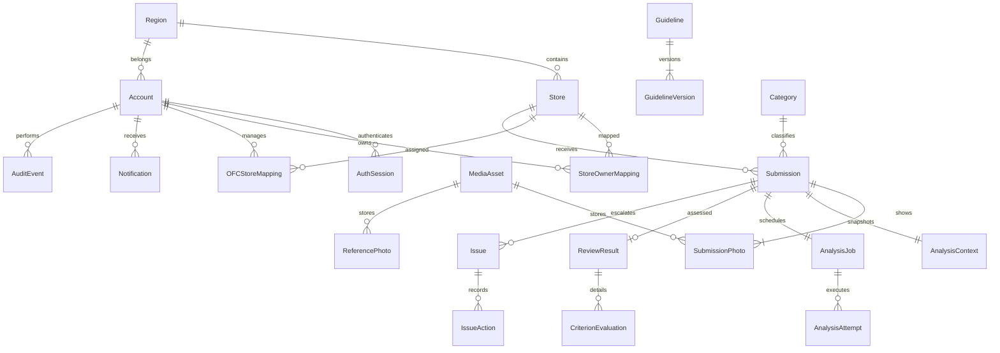

# 05. 데이터베이스 계약

- 버전: `CONTRACT-DATA-1.0` (검토 보완 `CONTRACT-DATA-1.0b`), 2026-09-21, 상태: **ACCEPTED** (G1 확정 등록부 참조)
- 소유자: db-schema. 모델과 Alembic revision은 단일 작성자가 관리한다.
- 기준: [00](00-vision.md), [01](01-architecture.md), [02](02-development-orchestration.md), [API](06-api.md).
- 변경 이유·검증: [작업 이력](../execute/workHitory/db-schema/contracts-v1.md).

## 1. 공통 표현과 보존

PostgreSQL이 인수검증 DB다. SQLAlchemy 2.x에서 UUID는 Python uuid/DB UUID, 시각은 timezone-aware UTC/TIMESTAMPTZ, JSON은 JSONB(제한적 SQLite 테스트에서는 JSON), 금액은 NUMERIC을 사용한다. SQLite는 외래키를 켜며 동시성 인수 증거로 사용하지 않는다. 아래 `id`는 UUID PK이고 `created_at`은 서버 UTC now 기본값이다. 별도 표시 없으면 NOT NULL이다. `?`는 NULL 가능. 모든 FK는 RESTRICT/NO ACTION이며 과거 업무 레코드는 연쇄 삭제하지 않는다. 문자열 enum은 CHECK 제약으로 선언해 SQLite와 계약을 공유한다.

수정 가능한 기준 정보·계정에는 `updated_at:timestamp`, `version:int>=1`이 있다. API 변경에는 읽은 `version`을 제출하고 조건부 UPDATE로 충돌을 409 처리한다. Account, Region, Store, Category의 삭제 API는 없고 `is_active:boolean=true`로 비활성화한다. 기준 버전, Reference 내용, 제출, 스냅샷, 성공 평가, 종료된 처리 시도는 불변이다. 작업의 현재 상태는 갱신되지만 이전 시도·감사 기록을 제거하지 않는다.

합성 데이터는 해당 데이터의 `source_kind`로 구분한다. 입력/매체의 값은 `user_upload|ai_generated_demo|seed_demo`, 리뷰의 값은 `real_ai|mock`, 운영 장애는 `is_fixture:boolean=false`다. 생성 이미지를 실제 모델이 분석하면 이미지 `ai_generated_demo`와 리뷰 `real_ai`를 함께 표시한다. 샘플 리뷰를 실제 모델 결과로 표시하지 않는다.

## 2. 관계 요약

`Escalation`은 별도 테이블을 만들지 않고 Issue(type=owner_question|ai_review_required)로 통합한다. 같은 스냅샷의 장애 재처리는 동일 Submission/AnalysisJob에 연결되고, 개선 재제출은 새로운 Submission.parent_submission_id로 연결된다.

## 3. 계정·조직·연결

| 테이블 / 필드 | 타입·제약·용도 |
|---|---|
| Region | id, code:varchar(32) UNIQUE, name:varchar(120), is_active, version, created_at, updated_at |
| Category | id, code:varchar(32) UNIQUE, name:varchar(120), description:text default '', is_active, version, created_at, updated_at. 카테고리 수/이름을 코드에 고정하지 않음 |
| Store | id, code:varchar(32) UNIQUE, name:varchar(120), region_id:FK Region, store_type:varchar(80), address:text default '', is_active, version, created_at, updated_at |
| Account | id, login_id:varchar(80) UNIQUE (입력 소문자 정규화), display_name:varchar(120), password_hash:text (Argon2id), role:enum(store_owner,ofc,regional,hq,platform_operator), region_id:FK Region?, is_active, version, created_at, updated_at |
| AuthSession | id, token_hash:char(64) UNIQUE, csrf_hash:char(64), account_id:FK Account?, created_at, expires_at:timestamp, revoked_at:timestamp?. account_id=NULL은 로그인 전 세션. expires_at>created_at |
| StoreOwnerMapping | id, account_id:FK Account, store_id:FK Store, created_at, ended_at:timestamp?, changed_by_id:FK Account, reason:varchar(500) |
| OFCStoreMapping | id, account_id:FK Account, store_id:FK Store, created_at, ended_at:timestamp?, changed_by_id:FK Account, reason:varchar(500) |

- `regional`과 `ofc`는 region_id 필수, `hq/platform_operator`는 NULL. store_owner의 region_id는 선택이며 권한은 매핑만으로 결정한다. 역할과 매핑의 일치, 활성 지역/매장, OFC 지역 일치는 서비스 트랜잭션에서 검증한다.
- 활성 StoreOwnerMapping은 UNIQUE(account_id,store_id) WHERE ended_at IS NULL. 매장에 여러 점주 허용. 활성 OFCStoreMapping은 UNIQUE(store_id) WHERE ended_at IS NULL로 매장당 OFC 한 명; UNIQUE(account_id,store_id) WHERE ended_at IS NULL도 둔다.
- 연결 변경은 이전 row의 ended_at을 설정하고 새 row를 생성한다. 역할/소속 변경 시 부적합 연결을 같은 트랜잭션에서 종료하고 감사 기록에 대상 ID를 남긴다. 과거 제출의 submitted_by_id는 바꾸지 않는다.
- 매장 지역 변경은 현재 OFC의 지역과 충돌하면 해당 연결을 종료한다. 지역 비활성화는 하위 매장을 영구 수정하지 않고 신규 업무를 제한한다. 기존 영업 기록은 현재 허용 매핑 범위 내 조회 가능하다.
- 인덱스: Store(region_id,is_active); Account(role,is_active), Account(region_id); 매핑(account_id,ended_at), 매핑(store_id,ended_at); AuthSession(expires_at), AuthSession(account_id,revoked_at).
- 세션은 토큰 원문을 저장하지 않는다. 원문 토큰 32바이트 이상의 CSPRNG, SHA-256 hash 저장, 익명 30분/인증 12시간 절대 만료, 로그인 성공시 rotate, logout revoke. 로그/감사에 토큰·비밀번호 해시를 넣지 않는다. 요청마다 Account와 현재 매핑을 DB에서 조회한다.

## 4. 가이드라인·Reference·미디어

| 테이블 / 필드 | 타입·제약·용도 |
|---|---|
| Guideline | id, rule_key:varchar(80), title:varchar(160), level:enum(HQ,REGION,STORE,CATEGORY), region_id:FK Region?, store_id:FK Store?, category_id:FK Category?, scope_key:varchar(180), is_active, current_version:int>=1, version:int>=1, created_by_id:FK Account, created_at, updated_at |
| GuidelineVersion | id, guideline_id:FK Guideline, version:int>=1, text:text (1..10000자), change_reason:varchar(500), created_by_id:FK Account, created_at. UNIQUE(guideline_id,version) |
| MediaAsset | id, storage_key:varchar(255) UNIQUE, thumbnail_key:varchar(255) UNIQUE, sha256:char(64), mime_type:enum(image/jpeg,image/png), byte_size:int (1..10485760), width:int 32..8192, height:int 32..8192, uploaded_by_id:FK Account, source_kind:enum(user_upload,ai_generated_demo,seed_demo), created_at |
| ReferencePhoto | id, lineage_id:UUID, version:int>=1, state_version:int>=1 default 1, photo_id:FK MediaAsset, category_id:FK Category, store_id:FK Store?, caption:varchar(2000), is_active, created_by_id:FK Account, created_at. UNIQUE(lineage_id,version), 최대 1개 활성 row/lineage |

Guideline.level 제약: HQ는 region/store NULL, category 선택; REGION은 region 필수/store NULL/category 선택; STORE는 store 필수/region NULL/category 선택; CATEGORY는 category 필수/region NULL/store 선택이다. CATEGORY.store_id가 있으면 해당 매장 매대 기준이고 NULL이면 전사 카테고리 기준이다. `scope_key`는 서버가 `LEVEL:target-or-all:category-or-all`로 계산하며 UNIQUE(scope_key,rule_key)로 같은 범위의 중복 기준을 막는다. 비활성화 후 같은 기준을 새 id로 복제하지 않고 새 버전으로 재활성화한다.

제출 시 store.region/category를 기준으로 활성 후보를 조회한다. `rule_key`별 CATEGORY > STORE > REGION > HQ를 적용한다. CATEGORY끼리는 매장 전용 > 전사 공통, 다른 동순위는 category 지정 > 공통 순이다. 이 규칙으로 동순위가 남는 입력은 등록시 차단한다. 최종 기준은 rule_key 정렬. 모든 후보와 선택된 버전을 스냅샷으로 보존해 제외 이유를 설명할 수 있다. 최종 기준100개 또는 본문 합계30,000자를 넘으면 제출을 거절한다.

Reference는 같은 category의 활성 항목 중 해당 store 전용 우선, 전사 공통 다음으로 `created_at DESC,id` 정렬하여 최대 3개를 선택한다. 다른 매장 전용 Reference는 선택/노출하지 않는다. Reference의 version은 불변 내용 revision이고 state_version은 활성상태/교체 충돌용 수정번호다. 모든 변경은 lineage의 최신 revision 행을 잠그고 요청 id가 최신인지 및 state_version이 일치하는지 확인한다. 오래된 revision에 대한 변경/재활성화는409다. Reference 교체·캡션 변경은 이전 row is_active=false/state_version+1과 새 row(lineage_id 동일,version+1,state_version=1)를 원자 생성한다. 활성상태 변경은 최신 revision의 state_version만1 증가시킨다. 파일 교체 시 MediaAsset도 새로 생성한다. 과거 스냅샷은 구버전 row/매체를 계속 참조한다. Reference 비활성화는 새 분석 선택에서만 제외한다.

미디어는 web public 디렉터리에 두지 않는다. storage_key는 서버 생성 상대경로이고 API에 노출하지 않는다. 업로드는 MIME/확장자/JPEG·PNG decode, 가로·세로32..8192/총4000만 pixel 이하를 확인하고 EXIF를 제거한 보호 파일·썸네일을 저장한다. 원본 바이트 해시는 정규화하여 실제 저장한 이미지의 sha256이다. 파일 저장 후 DB 실패 시 방금 생성한 고아 파일만 삭제한다. 기존 참조 파일은 지우지 않는다. 별도 일반 업로드 API 없이 submission/reference 트랜잭션에서 MediaAsset을 생성한다.

인덱스: Guideline(level,region_id,store_id,category_id,is_active), GuidelineVersion(guideline_id,version); ReferencePhoto(category_id,store_id,is_active), ReferencePhoto(lineage_id,version); MediaAsset(sha256) (중복 보존 허용).

## 5. 제출·입력 스냅샷·결과

| 테이블 / 필드 | 타입·제약·용도 |
|---|---|
| Submission | id, store_id:FK Store, category_id:FK Category, submitted_by_id:FK Account, question:varchar(2000) default '', parent_submission_id:FK Submission?, source_kind:enum(user_upload,ai_generated_demo,seed_demo), created_at |
| SubmissionPhoto | id, submission_id:FK Submission, media_id:FK MediaAsset, position:int 1..5. UNIQUE(submission_id,position), UNIQUE(submission_id,media_id) |
| AnalysisContext | id, submission_id:FK Submission UNIQUE, schema_version:varchar(16)='1.0', snapshot:JSONB, snapshot_sha256:char(64), created_at |
| ReviewResult | id, submission_id:FK Submission UNIQUE, attempt_id:FK AnalysisAttempt? UNIQUE, schema_version:varchar(16), result:JSONB, compliance_rate:numeric(5,1)?, assessable_rate:numeric(5,1)?, pass_count:int>=0, fail_count:int>=0, unknown_count:int>=0, needs_ofc_review:boolean, source_kind:enum(real_ai,mock), model_name:varchar(120)?, prompt_version:varchar(32), latency_ms:int>=0, created_at |
| CriterionEvaluation | id, review_id:FK ReviewResult, guideline_id:FK Guideline, version_id:FK GuidelineVersion, rule_key:varchar(80), verdict:enum(pass,fail,unknown), evidence:JSONB, actions:JSONB. UNIQUE(review_id,version_id) |

- 부모는 같은 store/category의 현재 계정 본인 제출이어야 한다. 순환은 새 row만 생성하므로 불가. 참조 부모가 권한 밖이면 404. 부모 성공 여부와 무관하게 새 사진 제출 가능하지만 `previous_review`는 부모의 성공 결과가 있을 때만 사용한다.
- 점주는 현재 연결 매장의 이력 조회가 가능하고 후속 요청/에스컬레이션은 자신이 제출한 건만 가능하다. 영업 사용자는 현재 담당 범위의 전체 이력을 조회한다.
- snapshot 구조: `store:{id,region_id,name}`, `category:{id,name}`, `question`, `photos:[{photo_id,media_id,position,mime_type,sha256}]`, `candidate_guidelines:[{guideline_id,version_id,version,level,rule_key,text,selected,selection_reason}]`, `guidelines:[{guideline_id,version_id,version,level,rule_key,text}]`, `references:[{reference_id,photo_id,position,caption,mime_type,sha256}]`, `previous_review:null|{submission_id,review_id,criteria}`. Snapshot에는 이름도 고정하되 서버 권한은 현재 Store/Account/Mapping으로 판단한다.
- 결과 JSON/참조 검증 후 ReviewResult+CriterionEvaluation+작업 성공+필요 Issue/Notification을 하나의 트랜잭션으로 저장한다. real_ai는 attempt_id 필수, mock만 NULL 가능. 결과 수정 API는 없다. OFC 의견은 IssueAction으로 남긴다.
- 점수는 API/worker가 기준 결과에서 계산한다. compliance_rate=100*pass/(pass+fail), 분모 0이면 NULL. assessable_rate=100*(pass+fail)/전체 기준, 기준 0이면 NULL. `unknown`을 fail 또는 pass로 치환하지 않는다. 모든 rate는 0..100 또는 NULL CHECK이며 소수1자리로 반올림한다. JSON 결과와 집계 row는 같은 검증된 입력에서 만들어 일치 검사한다.
- 인덱스: Submission(store_id,category_id,created_at DESC), Submission(submitted_by_id,created_at DESC), Submission(parent_submission_id), ReviewResult(created_at), CriterionEvaluation(rule_key,verdict).

## 6. 분석 작업·시도·멱등

| 테이블 / 필드 | 타입·제약·용도 |
|---|---|
| AnalysisJob | id, submission_id:FK Submission UNIQUE, status:enum(queued,running,succeeded,failed), current_attempt_id:FK AnalysisAttempt?, enqueue_generation:int>=1 default 1, queued_at:timestamp, queue_deadline_at:timestamp, started_at:timestamp?, finished_at:timestamp?, error_code:varchar(64)?, error_message:varchar(240)?, is_fixture:boolean=false, created_at, updated_at |
| AnalysisAttempt | id, job_id:FK AnalysisJob, attempt_number:int>=1, status:enum(queued,running,succeeded,failed,expired), requested_by_id:FK Account?, worker_id:varchar(120)?, queued_at:timestamp, started_at:timestamp?, deadline_at:timestamp?, lease_expires_at:timestamp?, heartbeat_at:timestamp?, finished_at:timestamp?, error_code:varchar(64)?, error_message:varchar(240)?, result_applied:boolean=false, created_at. UNIQUE(job_id,attempt_number) |
| IdempotencyRecord | id, account_id:FK Account, operation:varchar(80), key:varchar(128), request_hash:char(64), resource_id:UUID, response_status:int, created_at. UNIQUE(account_id,operation,key) |

최초 제출은 queued Job만 생성하며 current_attempt_id=NULL이다. worker가 원자적으로 점유하면 running Attempt를 만든다. 실패 재처리는 Job 행을 잠그고 failed 상태를 조건으로 enqueue_generation+1, queued Attempt 예약, current_attempt_id 교체를 같은 트랜잭션으로 실행한다. worker는 예약 Attempt를 running으로 전환한다. 기존 종료 Attempt는 변경하지 않는다.

최초 큐 기한초과도 expired Attempt(미시작, QUEUE_TIMEOUT)를 생성해 이력을 남긴다. 재처리의 예약 Attempt는 동일 기한초과에서 expired가 된다. Job은 failed로 종료한다. 상세 전이·CAS·늦은 응답 거부는 [07-ai-processing.md](07-ai-processing.md)를 정본으로 삼는다. 기본값은 큐180초, CLI120초, HTTP130초, lease140초, heartbeat10초다. Attempt.deadline_at은 worker 시작+130초(결과 수용 기한)이며 CLI 자체 제한120초와 구분한다. 기술 실패를 판단 불가로 치환하지 않는다.

- 부분 UNIQUE(job_id) WHERE status IN ('queued','running')로 활성 Attempt는 최대1개다. 성공 결과는 Submission UNIQUE와 Attempt UNIQUE로 이중 저장을 막는다.
- worker 점유는 `SELECT ... FOR UPDATE SKIP LOCKED`로 queued Job을 가져와 신규/예약 Attempt를 같은 트랜잭션에서 running으로 만든다. AI HTTP 응답 대기 중 DB 잠금을 유지하지 않는다.
- 결과 반영은 Job.status=running, current_attempt_id 일치, Attempt.status=running, deadline/lease 미초과를 조건으로 갱신하며 리뷰와 원자 저장한다. 만료·종료 이후의 늦은 응답은 버리고 종료 Attempt를 다시 변경하지 않는다.
- 재처리 API와 IdempotencyRecord는 같은 트랜잭션이다. 키 재송신은 같은 resource/status, request_hash 불일치는409다. 다른 키여도 running/queued/succeeded면409. POC 기간 전체 보존하고 TTL로 삭제하지 않는다.
- operation은 HTTP 경로 template에 대응하는 고정 이름이며 target ID를 operation에 붙이지 않는다. request_hash는 메서드·실제 URL 대상 ID(job_id/store_id 등)·정규화 JSON·이미지 순서 및 저장형식 hash를 포함한다. 같은 key를 같은 reason으로 다른 대상에 쓰면409다. multipart boundary나 파일명만 다르면 의미적 차이로 취급하지 않는다. 매번 현재 권한/CSRF 검사 후 멱등 응답을 반환한다.
- 재시작·주기 루프는 기한초과 queued/running을 복구한다. running은 expired+WORKER_INTERRUPTED 또는 MODEL_TIMEOUT, Job failed다. 성공 Job은 복구 대상으로 삼지 않는다.
- 인덱스: AnalysisJob(status,queued_at), AnalysisJob(status,queue_deadline_at), AnalysisAttempt(job_id,attempt_number), AnalysisAttempt(status,lease_expires_at), IdempotencyRecord(created_at). 순환 FK current_attempt_id는 migration 마지막에 추가한다(SQLite batch 대응).

## 7. 이슈·후속 조치·알림

| 테이블 / 필드 | 타입·제약·용도 |
|---|---|
| Issue | id, submission_id:FK Submission, review_id:FK ReviewResult?, type:enum(owner_question,ai_review_required), status:enum(open,in_progress,resolved), priority:enum(normal,high), title:varchar(160), description:varchar(2000), assignee_id:FK Account?, created_by_id:FK Account?, resolution:varchar(2000)?, next_check_at:timestamp?, version:int>=1 CHECK(ck_issue_version), created_at, updated_at, resolved_at:timestamp? |
| IssueAction | id, issue_id:FK Issue, actor_id:FK Account, action_type:enum(comment,status_change,assignment), body:varchar(2000), from_status:varchar(32)?, to_status:varchar(32)?, created_at |
| Notification | id, recipient_id:FK Account, kind:enum(review_ready,issue_created,issue_updated), submission_id:FK Submission?, issue_id:FK Issue?, title:varchar(160), read_at:timestamp?, created_at, dedupe_key:varchar(180) UNIQUE |

- AI 결과 needs_ofc_review=true면 type=ai_review_required Issue를 최대 1개 만든다(UNIQUE submission_id WHERE type='ai_review_required'). 자동 이슈는 created_by_id=NULL. 현재 담당 OFC를 assignee로, 없으면 NULL로 두어 지역/HQ 목록에 노출한다.
- 점주는 자기 제출에 owner_question을 생성한다. AI 결과를 직접 수정하지 않는다. 영업 역할이 담당 범위에서 comment/assign/status 변경한다. assignee는 같은 매장의 현재 담당 OFC 또는 권한 있는 regional/hq만 허용. 상태 resolved는 resolution 필수. 재개는 open으로 전환하고 기존 조치 이력을 보존한다.
- Notification은 DB 안의 앱 수신함이며 외부 전송 없다. review_ready는 제출자, issue_created는 배정된 담당자, issue_updated는 제출자와 변경 후 담당자에게 저장하되 중복키로 원자 생성한다. 수신자는 읽기 직전 현재 계정·대상 영업 권한을 재검증한다. 권한이 사라진 알림은 목록·미읽음 수에서 제외; 다른 수신자 알림과 운영자의 영업 알림 접근 차단.
- 인덱스: Issue(status,assignee_id,updated_at), Issue(submission_id); IssueAction(issue_id,created_at); Notification(recipient_id,read_at,created_at).

## 8. Mock 분석·운영

| 테이블 / 필드 | 타입·제약·용도 |
|---|---|
| SalesMock | id, store_id:FK Store, category_id:FK Category, week_start:date (월요일), amount:numeric(14,2)>=0, source_kind='mock', created_at. UNIQUE(store_id,category_id,week_start) |
| InventoryMock | id, store_id:FK Store, category_id:FK Category, sku:varchar(80), name:varchar(120), quantity:int>=0, observed_on:date, source_kind='mock', created_at. UNIQUE(store_id,sku,observed_on) |
| AuditEvent | id, actor_id:FK Account, action:varchar(80), target_type:varchar(80), target_id:UUID, reason:varchar(500), before_data:JSONB, after_data:JSONB, outcome:enum(succeeded,rejected), request_id:UUID, created_at |
| ServiceStatus | id, service_name:varchar(80) UNIQUE, status:enum(up,down,unknown), checked_at:timestamp, heartbeat_at:timestamp?, last_success_at:timestamp?, last_failure_at:timestamp?, error_code:varchar(64)?, is_fixture:boolean=false, details:JSONB (허용목록 메타데이터만) |
| Announcement | id, title:varchar(160), body:varchar(4000), severity:enum(info,maintenance), starts_at:timestamp, ends_at:timestamp?, is_active, version:int>=1, created_by_id:FK Account, created_at, updated_at. ends_at>starts_at if nonnull |

운영 감사는 계정/역할/지역/매장/카테고리/매핑/공지/재처리 변경과 같은 트랜잭션으로 저장한다. before/after 허용 필드는 ID, 역할, 활성 상태, 이름, 연결, 처리 상태이다. password_hash·session/CSRF/token·질문·사진·평가·매출·원시 stderr는 금지한다. 실패한 업무 변경은 롤백 후 별도 짧은 트랜잭션으로 rejected 감사만 기록할 수 있다. 조회/수정/삭제 API 중 감사에는 조회만 제공한다.

ServiceStatus는 건강 상태 메타데이터이며 프롬프트/결과를 복제하지 않는다. API/DB 직접 확인, AI /health의 프로세스 준비 상태, worker heartbeat age, 마지막 실제 모델 성공/실패 시각을 분리한다. health polling으로 실제 모델을 호출하지 않는다. 데모 실패는 is_fixture=true로 표시한다.

집계 테이블은 만들지 않는다. 대시보드·추세·리포트는 권한 필터된 Submission/Review/Issue를 계산한다. 기본 기간은 최근 28일 UTC 날짜, 주차는 UTC 월요일 기준이다. 매출 상관은 같은 store/category/week의 리뷰 compliance 평균과 SalesMock 쌍; NULL 준수도/결측 매출 제외, n>=3 및 양쪽 분산>0일 때만 Pearson r 산출한다. 응답에는 n, 제외건수, assessable_rate, mock=true, 계산 불가 사유를 포함한다. 미제출은 위반이 아니다. 자세한 API 집계 정의는 06 §8.

인덱스: SalesMock(week_start,store_id,category_id), InventoryMock(store_id,category_id,observed_on); AuditEvent(created_at), AuditEvent(target_type,target_id,created_at), AuditEvent(actor_id,created_at); Announcement(is_active,starts_at,ends_at).

## 9. 마이그레이션·시드·검증

| 순서 | Alembic revision 범위 | 선행 / 검증 |
|---|---|---|
| 0001_identity | Region, Category, Account, AuthSession, Store, 두 매핑 | PostgreSQL 연결 → FK/check/부분 고유 확인 |
| 0002_content | Guideline, GuidelineVersion, MediaAsset, ReferencePhoto | 계정·기준 정보 선행, 불변 버전과 이미지 보존 확인 |
| 0003_review_jobs | Submission, SubmissionPhoto, AnalysisContext, AnalysisJob(current_attempt FK 제외), AnalysisAttempt, current_attempt FK 추가, ReviewResult, CriterionEvaluation, IdempotencyRecord | 순환 FK 분리, 한 제출 한 결과, 동시 점유·재처리 시험 |
| 0004_workflow_operations | Issue, IssueAction, Notification, SalesMock, InventoryMock, AuditEvent, ServiceStatus, Announcement | 이슈/알림 권한, 감사 원자성, 집계 계산 확인 |

마이그레이션은 순서대로 `alembic upgrade head`; 앱 시작 create_all 금지. downgrade는 개발 전용 별도 빈 테스트 DB에서만 검증하며 공유 시연 데이터 삭제에 사용하지 않는다. UUID 안정 시드 순서는 지역/카테고리 → 계정(실행시 비밀번호 주입) → 매장/매핑 → 매체/기준버전/Reference → 제출/스냅샷/작업·시도/Mock 리뷰 → 이슈·알림 → 4~8주 매출/재고 → 운영 fixture/공지/감사다. 고정 namespace UUID 또는 code upsert로 중복 방지하고 기본 실행에 기존 데이터 삭제를 넣지 않는다.

필수 DB 검증: 빈 DB upgrade 및 모델 차이 없음, role/mapping 불일치 차단, 연결 변경 후 기존 세션 범위 감소, 보호 미디어 IDOR, 비활성화 후 과거 FK 보존, 기준 교체 후 snapshot 불변, 동일 key·동시 다른 key 제출/재처리, 다중 worker 점유, worker 중단·기한초과·늦은 결과 CAS, 성공결과 덮어쓰기 불가, 알림 수신자 분리, 감사의 영업본문/비밀 제외, missing/variance0/n<3 상관 처리. 실행 증거는 G2 이후 남기며 현재 문서 검토를 실행 통과로 표현하지 않는다.
